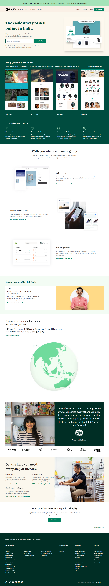

## 🔗Shopify Clone
[https://vishal-shopify-clone.netlify.app/](https://vishal-shopify-clone.netlify.app/)

## ⭐ Shopify Clone ⭐

This is the assignment given in the **"JavaScript Full Stack Web Developer Bootcamp"** by **iNeuron** *&* This Assignment was done using **HTML5, CSS3 & Tailwind CSS.**

### 📌 Tech Stack

&nbsp; &nbsp;

### 📌 Overview 

 

### 📌 What I Learn

> 👉 How to Structure **Tailwind CSS**  
  👉 Mobile First Approach  
  👉 How to Configure Tailwind  
  👉 How to customize Tailwind CSS 
  👉 How to read Documentation

### Time Taken to Complete this Project:- 17 Hours

### 📬 Connect With Me

- **LinkedIn** - [Vishal Rikhi](https://www.linkedin.com/in/vishal-rikhi/)

### 📌 Acknowledgement

- **Course Instructor** - [Hitesh Choudhary](https://www.linkedin.com/in/hiteshchoudhary/)

